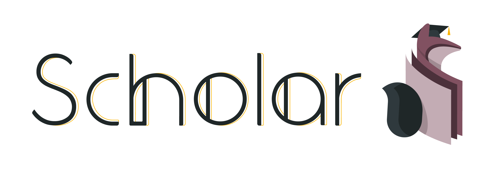

<h1></h1>

Machine learning tools built on top of Nx.

For deep learning, see [Axon](https://github.com/elixir-nx/axon).

## Installation

If [available in Hex](https://hex.pm/docs/publish), the package can be installed
by adding `scholar` to your list of dependencies in `mix.exs`:

```elixir
def deps do
  [
    {:scholar, "~> 0.1.0"}
  ]
end
```

Documentation can be generated with [ExDoc](https://github.com/elixir-lang/ex_doc)
and published on [HexDocs](https://hexdocs.pm). Once published, the docs can
be found at <https://hexdocs.pm/scholar>.

## License

Copyright (c) 2022 The Machine Learning Working Group of the Erlang Ecosystem Foundation

Licensed under the Apache License, Version 2.0 (the "License");
you may not use this file except in compliance with the License.
You may obtain a copy of the License at [http://www.apache.org/licenses/LICENSE-2.0](http://www.apache.org/licenses/LICENSE-2.0)

Unless required by applicable law or agreed to in writing, software
distributed under the License is distributed on an "AS IS" BASIS,
WITHOUT WARRANTIES OR CONDITIONS OF ANY KIND, either express or implied.
See the License for the specific language governing permissions and
limitations under the License.
